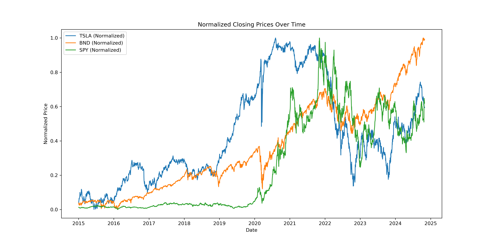
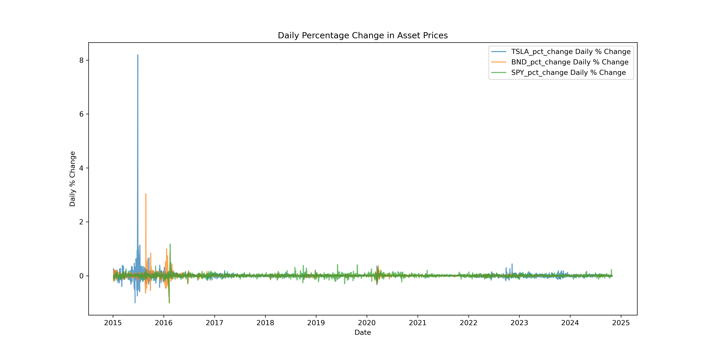
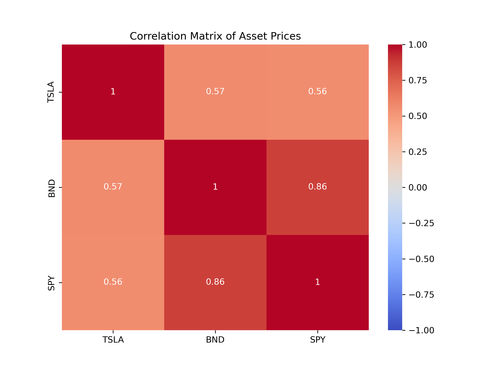
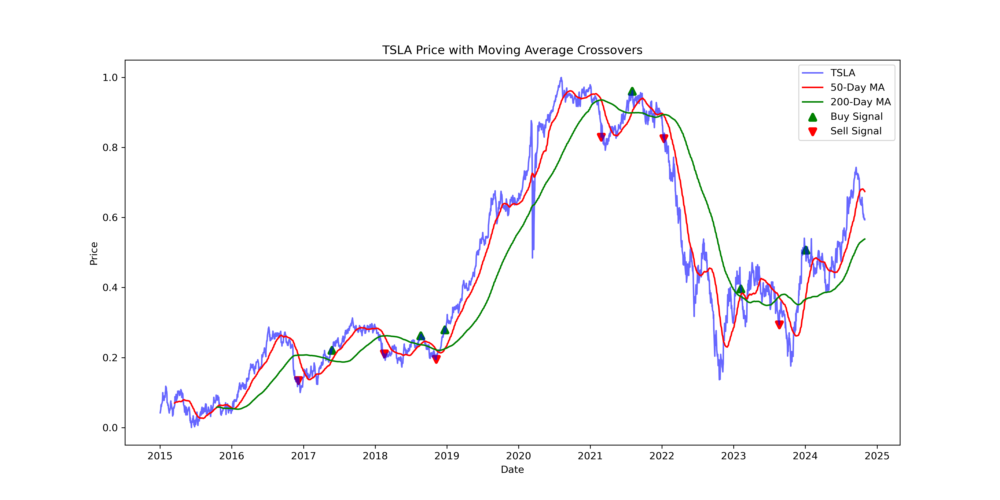
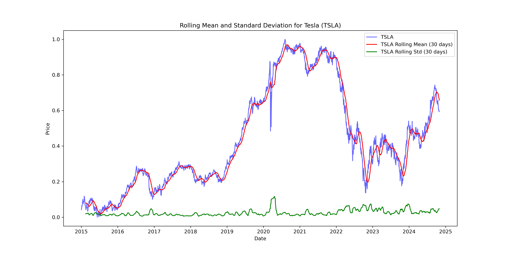
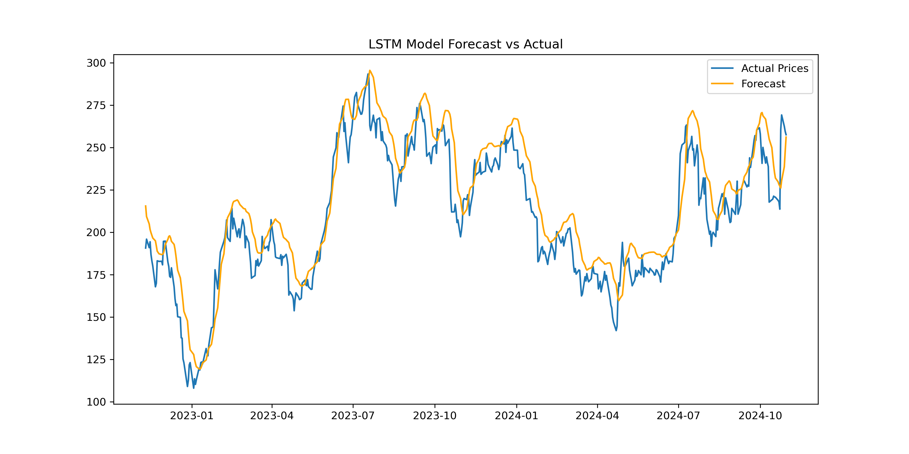

# KAIM Weak 11 Challenge

## Time Series Forecasting for Portfolio Management Optimization

### Project Overview
This project aims to enhance portfolio management strategies for Guide Me in Finance (GMF) Investments by leveraging advanced time series forecasting models. By predicting future stock prices, market trends, and associated risks, we provide data-driven insights to optimize asset allocation, enhance returns, and manage risks effectively.

#### Objectives
The project’s primary goals are to:
1. Preprocess and analyze historical financial data for key assets.
2. Develop and evaluate time series forecasting models to predict future stock prices, with a focus on Tesla (TSLA).
3. Forecast future market trends and assess their implications on portfolio strategy.
4. Optimize an investment portfolio based on the forecasted data to maximize returns and minimize risks.

### Data Sources and Assets
Data was sourced using the `YFinance` Python library, covering the period from January 1, 2015, to October 31, 2024, for the following assets:
- **Tesla (TSLA)**: Represents a high-risk, high-reward stock.
- **Vanguard Total Bond Market ETF (BND)**: Provides stability and low risk.
- **S&P 500 ETF (SPY)**: Offers moderate-risk market exposure.

The dataset includes daily metrics such as Open, High, Low, Close, Adjusted Close, and Volume.

### Project Structure

```bash

    ├── data/
    │   ├── raw/                 
    │   └── processed/
    ├── figures/
    ├── scripts/
    │   ├── main.py                 
    ├── notebooks/
    ├── src/
    │    ├── data/
    │       ├── data_loader.py                 
    │       └── data_preprocessing.py
    │       └── train_test_split.py
    │    ├── eda/
    │       ├── price_analysis.py                 
    │       └── trend_analysis.py
    │       └── visualize.py
    │    ├── forecasting/
    │       ├── arima_model.py                 
    │       └── lstm_model.py
    │       └── sarima_model.py
    │       ├── prophet_model.py                 
    │       └── model_evaluation.py
    │    ├── portfolio/
    │       ├── optimization.py                 
    │       └── performance_metrics.py
    │       └── risk_metrics.py
    │    ├── utils/
    │       ├── time_utils.py                 
    │       └── yfinance_loader.py
    │    ├── utils.py
    ├── tests/    
    ├── README.md                
    ├── requirements.txt  

```

### Steps and Key Insights

#### Task 1: Preprocess and Explore the Data
1. **Data Cleaning**: We handled missing values and ensured all columns were appropriately typed.
2. **Exploratory Data Analysis (EDA)**: 
   - We visualized historical closing prices, calculated daily percentage changes to analyze volatility, and identified significant anomalies.
   - **Key Insights**: TSLA exhibited high volatility with substantial returns over time, BND maintained stability, and SPY provided moderate risk diversification.

#### Task 2: Develop Time Series Forecasting Models
1. **Model Selection**:
   - We chose three models for time series forecasting: **ARIMA**, **SARIMA**, and **LSTM**.
   - Based on their performance, **SARIMA** showed robust accuracy in capturing seasonal trends in Tesla’s stock prices.
2. **Evaluation Metrics**:
   - Mean Absolute Error (MAE): Quantified the average absolute prediction errors.
   - Root Mean Squared Error (RMSE): Highlighted the model’s sensitivity to large errors.
   - Mean Absolute Percentage Error (MAPE): Measured the prediction accuracy as a percentage.

#### Task 3: Forecast Future Market Trends
1. **Forecast Generation**:
   - Using the SARIMA model, we generated a 12-month forecast for Tesla’s stock price.
2. **Forecast Analysis**:
   - The forecasts were visualized alongside historical data with confidence intervals to capture potential volatility.
3. **Trend and Risk Insights**:
   - **Trend Analysis**: Tesla showed a gradual upward trend with high volatility in specific forecasted periods.
   - **Volatility and Risk**: The model predicted periods of increased volatility, advising caution for high-risk investments.
   - **Market Opportunities and Risks**: Forecasted price increases suggested potential growth opportunities, while anticipated volatility indicated a need for balanced asset allocation.

#### Task 4: Optimize Portfolio Based on Forecast
1. **Portfolio Construction**:
   - A simple portfolio comprising **TSLA**, **BND**, and **SPY** was created to balance risk and returns.
2. **Return and Risk Calculation**:
   - Annual returns were computed for each asset, and the covariance matrix provided insights into asset correlations.
3. **Portfolio Optimization**:
   - Using Sharpe Ratio maximization, we optimized the portfolio to enhance returns relative to risk.
4. **Portfolio Analysis**:
   - **Expected Return**: The optimized portfolio demonstrated a favorable return.
   - **Volatility**: BND’s stability balanced Tesla’s high volatility.
   - **Sharpe Ratio**: The high Sharpe Ratio indicated a strong risk-adjusted return.
5. **Final Allocation Recommendation**:
   - Suggested increasing allocations to BND to mitigate Tesla’s high volatility, while maintaining SPY as a diversified moderate-risk component.

### Results and Conclusion
By combining data-driven insights from time series forecasting with portfolio optimization, we created a strategic asset allocation plan that maximizes returns while minimizing risk. This model provides GMF Investments with a solid foundation for making informed decisions, improving client portfolios, and adapting to future market conditions.

### Usage
To execute the project pipeline:

```bash

    git clone https://github.com/tedoaba/KAIM-W11.git
    cd KAIM-W11

    python -m venv venv
    source venv/Scripts/activate

    pip install -r requirements.txt

    cd scripts

    python main.py

```

### Visualizations

#### Normalize Price



#### Daily Price Change 



#### Correlation Matrix



#### Moving Average Crosseover



#### Rolling Stats



#### Train-Test Split


#### LSTM Forecast



#### Prophet Forecast


#### Trend Volatility


#### Opportunities and Risks


#### Portfolio


### Future Improvements
- **Incorporate More Asset Classes**: Include additional stocks, commodities, and other ETFs for a broader asset base.
- **Refine Forecasting Techniques**: Experiment with hybrid models and ensemble methods for improved prediction accuracy.
- **Enhance Risk Management**: Implement advanced risk metrics such as Conditional Value at Risk (CVaR) to strengthen downside protection.

### Authors
This project was completed by [Tadesse Abateneh](https://www.linkedin.com/in/tadesse-abateneh) 

For further details, questions, or collaborations, please reach out to [Email](tedoaba@gmail.com)
